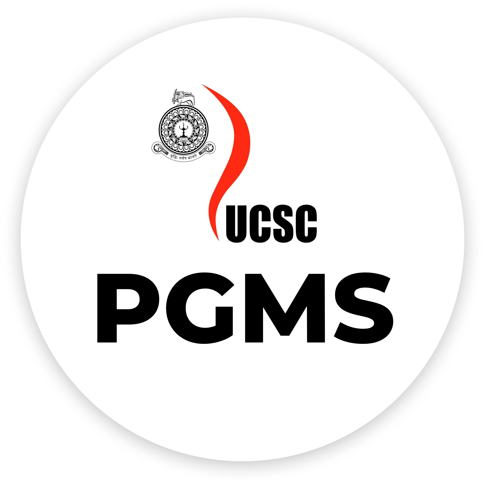

# Postgraduate Management System for University of Colombo School of Computing

<h1 align="center">
   
  
   
   
</h1>

<h4 align="center">3nd Year Group Project.</h4>

  Group 26

 PGMS (Postgraduate Management System) focuses on the administration of the postgraduate unit of University of Colombo School of Computing.
It aims to provide an automated platform that  streamlines and modernizes the current manual processes within the postgraduate unit  of UCSC.

## Key Features

* Payment Voucher and Report Generation
* Timetable Management
* Lecturer Attendance Tracking
* Intake and Course Management
* Nominations and Applications
* Dashboard with Event Calendar
* Profile Management
* Search and Filteration
